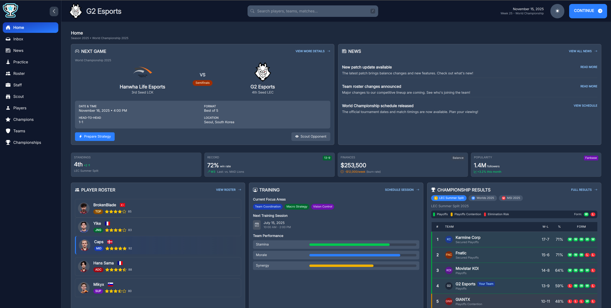
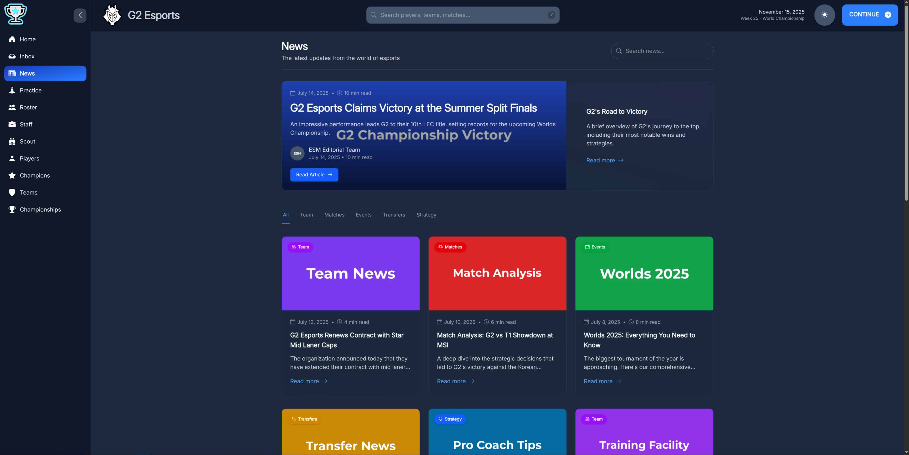
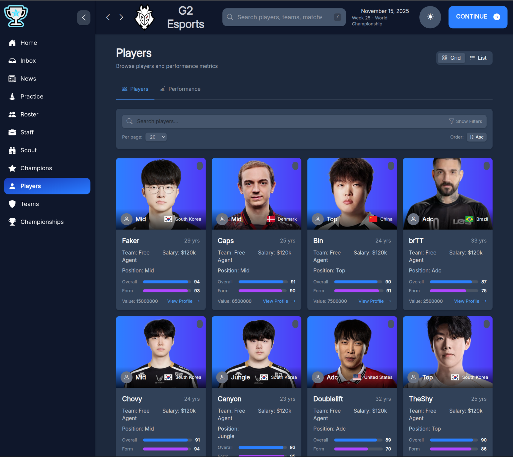
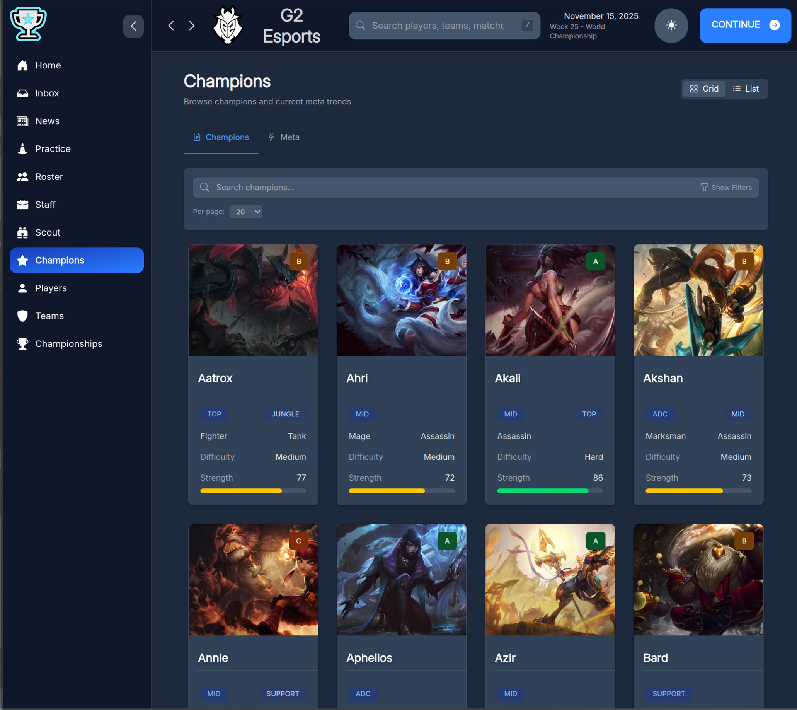

<!--
SPDX-FileCopyrightText: 2025 Pedrenrique G. Guimarães <admin@esportsmanager.net>
SPDX-License-Identifier: GPL-3.0-or-later
License-Filename: LICENSES/GPL-3.0-or-later
-->

<div align="center">


# eSports Manager

[](https://www.gnu.org/licenses/gpl-3.0)
[](https://www.python.org/downloads/)
[](https://GitHub.com/esports-manager/esports-manager/graphs/commit-activity)
[](https://github.com/esports-manager/esports-manager/commits/develop)
[](https://GitHub.com/esports-manager/esports-manager/graphs/contributors/)

**A free and open source eSports management simulation game**

[Features](#features) • [Screenshots](#screenshots) • [Installation](#installation) • [Getting Started](#getting-started) • [Contributing](#contributing) • [License](#license)

⚠️ **DEVELOPMENT STATUS:** This project is actively being developed and is not yet ready for gameplay. The codebase is currently undergoing significant restructuring. ⚠️

</div>

---

**eSports Manager** is an ambitious free and open source management simulation game, inspired by classic titles like Football Manager and Championship Manager, but focused on the exciting world of competitive gaming.

In eSports Manager, you'll:

- **Manage your own professional eSports team** across various game titles
- **Discover and develop talent** from solo queue and amateur leagues
- **Create strategies** for your team
- **Compete in major leagues and championships** against the world's best teams
- **Handle team finances, sponsorships, and player contracts** to build a sustainable organization
- **Train your squad** with specialized coaching staff and practice regimens
- **Experience matches** through detailed text-based commentary and statistics

The game aims to provide an authentic and deep management experience for eSports enthusiasts and simulation game fans alike.

## Features

### Current Features

- Comprehensive player management system with detailed attributes and statistics
- Team management with finances, facilities, and staff
- Staff management with specialized roles and skill systems
- Match simulation engine with detailed statistics
- Scouting system for discovering talent
- Champions database with role-specific attributes

### Planned Features

- Multiple game titles (MOBA, FPS, etc.) with unique mechanics
- Complete career mode with goals and achievements
- In-depth match tactics and strategy system
- Media interaction and player psychology system
- Custom tournament creation
- Realistic transfer market with negotiations

For a more detailed breakdown of current and planned features, check the [FEATURES.md](FEATURES.md) document.

## Screenshots

The UI is currently being reworked with a modern web-based interface. Here are some previews of the current development state:

<table>
<tr>
<td>
  
</td>
<td>
  
</td>
</tr>
<tr>
<td>
  
</td>
<td>
  
</td>
</tr>
</table>


## Installation

### Prerequisites

- Python 3.10 or higher
- Git

### Development Setup

1. **Clone the repository**
   ```bash
   git clone https://github.com/esports-manager/esports-manager.git
   cd esports-manager
   ```

1. **Set up the environment and install dependencies**
   ```bash
   uv venv .venv
   uv sync
   ```

1. **Activate the virtual environment**
   - On Linux/macOS:
     ```bash
     source .venv/bin/activate
     ```
   - On Windows:
     ```bash
     .venv\Scripts\activate
     ```

1. **Initialize the database**
   ```bash
   uv run python scripts/init_db.py
   ```

1. **Run the development server**
   ```bash
   uv run uvicorn dev:app --reload
   ```


For more detailed setup instructions, including troubleshooting tips, refer to the [CONTRIBUTING.md](CONTRIBUTING.md#development-environment-setup) document.

## Getting Started

### Running the Game

To run the main application:
```bash
uv run python esm.py
```

Access the web interface at:
- Frontend: http://localhost:8000
- API documentation: http://localhost:8000/docs

### Development Mode

For frontend development with hot reloading of styles:

```bash
uv run tailwindcss -i frontend/static/css/input.css -o frontend/static/css/tailwind.css --watch
```

```bash
uv run uvicorn dev:app --reload
```

## Contributing

Contributions are welcome and greatly appreciated! eSports Manager is a community-driven project and we value all forms of contributions, from code to documentation, design to testing.

See [CONTRIBUTING.md](CONTRIBUTING.md) for detailed information on:
- Code conventions and style
- Development workflow
- Issue reporting
- Pull request process
- Testing guidelines

### Ways to Contribute

- Report bugs or request features using our issue templates
- Improve or expand documentation
- Submit code improvements or new features
- Help test the application
- Share ideas and feedback

## Contact

- **Email**: admin@esportsmanager.net
- **Discussions**: [Discussions](https://github.com/esports-manager/esports-manager/discussions) 
- **[GitHub Issues](https://github.com/esports-manager/esports-manager/issues)**: For bug reports and feature requests

## License

eSports Manager is licensed under the GNU General Public License v3.0 (GPL-3.0).

```
eSports Manager - A free and open source eSports management game
Copyright (C) 2020-2025  Pedrenrique G. Guimarães

This program is free software: you can redistribute it and/or modify
it under the terms of the GNU General Public License as published by
the Free Software Foundation, either version 3 of the License, or
(at your option) any later version.

This program is distributed in the hope that it will be useful,
but WITHOUT ANY WARRANTY; without even the implied warranty of
MERCHANTABILITY or FITNESS FOR A PARTICULAR PURPOSE.  See the
GNU General Public License for more details.

You should have received a copy of the GNU General Public License
along with this program. If not, see <https://www.gnu.org/licenses/>.
```

For the full license text, see the [LICENSE.md](LICENSE.md) file.
