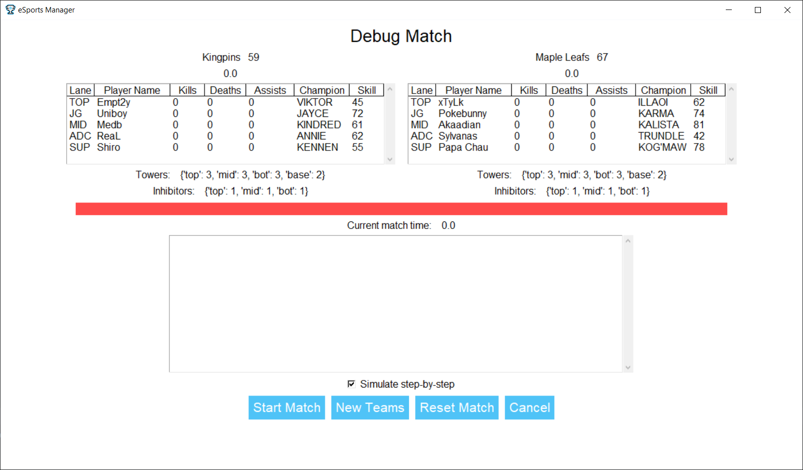
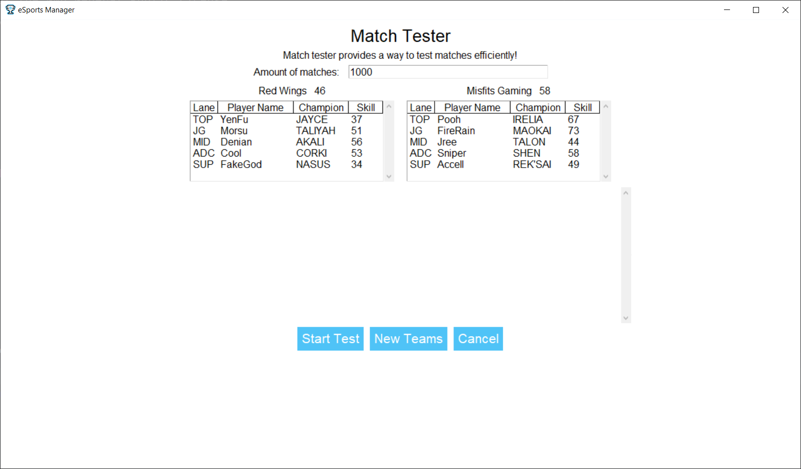
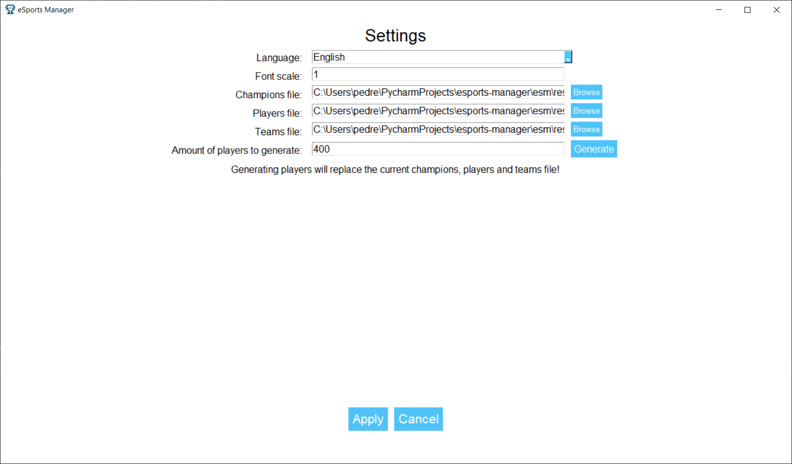

**NOTE:** *THIS PROJECT IS STILL UNDER DEVELOPMENT, AND IS NOT READY FOR GAMEPLAY YET.*


# eSports Manager

**eSports Manager** aims to become a free and open source eSports management game, licensed under the [GPLv3](LICENSE.md), based on titles like Football Manager and the deceased Championship Manager.

The idea here is to bring a full-fledged experience in eSports, playing major leagues and big championships, managing players, setting up practices and discovering new talents.

In this game, you will be able set up your team, get them to play in whatever position you would like them to, set up strategies, choose which race/champion/hero they're going to play with, and read match descriptions as they happen live, much like Football Manager on its early days. Managing finances, finding sponsors, boosting your players' morale are also going to play a role in that experience.

## INSTALLATION

The game is still not ready to be played. Many features are yet to be implemented, and a lot of things are missing. There's no gameplay experience, only testing material here.

## SCREENSHOTS










## HOW TO RUN THE DEBUG VERSION

To run the debug version first you need to have Python 3 installed. Use Python 3.7 or higher, there's no guarantee it will work with Python 3.6 or older.

To manage dependencies, we use Pipenv. To install pipenv:

```
pip install pipenv
```

Then, clone the repo and run:

```
pipenv install
```

And then you can do:

```
pipenv shell
```

To get into the python virtual environment shell. And then just run:

```
python run.py
```

You can test the Debug Match window, and check other dummy features like New Game, Load Game, and Settings.

## FEATURES

Check [FEATURES.md](FEATURES.md) to get more information on the planned features and features that are already implemented.

## CONTRIBUTE

Check our [CONTRIBUTING.md](CONTRIBUTING.md) to get more information on how to contribute to the project.

## LICENSE

    eSports Manager - A free and open source eSports management game
    Copyright (C) 2020-2022  Pedrenrique G. Guimarães

    This program is free software: you can redistribute it and/or modify
    it under the terms of the GNU General Public License as published by
    the Free Software Foundation, either version 3 of the License, or
    (at your option) any later version.
    This program is distributed in the hope that it will be useful,
    but WITHOUT ANY WARRANTY; without even the implied warranty of
    MERCHANTABILITY or FITNESS FOR A PARTICULAR PURPOSE.  See the
    GNU General Public License for more details.

    You should have received a copy of the GNU General Public License
    along with this program.  If not, see <http://www.gnu.org/licenses/>.

Check [LICENSE](LICENSE.md) for more information.
