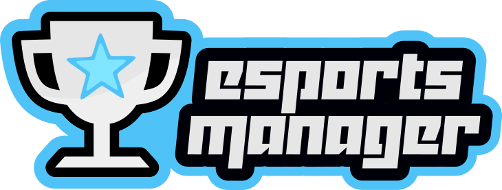

# eSports Manager Docs

Welcome to the eSports Manager Documentation. Here you will find information about the game, how to play, game design choices, and all the elements that you can find in the game. Every single piece of information: code API, installation process, FAQ, diagrams and mock-ups, code insights and feature brainstorms will be written here.

In the future, all this info will also be part of our Wiki and website.

## About

eSports Manager is a free and open source eSports management game. In this game you will manage an eSports team and guide it to victory and glory. You will be able to hire and fire players, choose which players are going to play in specific matches, and even what exactly they're going to play in that specific match (champion/hero/race), organize practice sessions, sign sponsor contracts and much more. The goal is to give the player the ultimate experience on team management, just as if they're real managers, managing a real eSport team.

From an implementation point of view, and taking advantage of the open source model, the game will aims to become a great source for people that want to create similar projects, and tries to follow the best programming practices. You will be able to read and study the source code, as well as improve, copy, distribute it and contribute back to this project at any time. The "free" here, in this case, means both free as in "freedom" and free as in "free beer". Check the [LICENSE](../LICENSE.md) for more information.

### Contents

Still under construction.